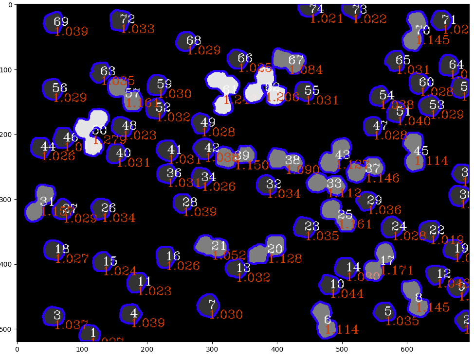

# Analysis of BioImages (in Progress)

# Abstract
This project aims at analysing micrographs and other images of biological matter. The underlying data can be obtained freely from many scientific bioinformatics databases (check out my website www.bio-century.net for further info). This "Part 1" is a collection of Python-based example codes focussing on the Analysis of Micrographs on a very basic level. More parts are to come soon...<br>
Goals and example code is presented in a Jupyter-Notebook-(.ipynb-)fileformat. Jupyter-NB or equivalent extensions in the IDE of your choice is thus required to modify it. 
<br><br>
Example of a test dataset identifying multi-nuclei overlays in fluorescence micrographs:<br>
<br>


# Table of Content
- [Analysis of BioImages (in Progress)](#analysis-of-bioimages-in-progress)
- [Abstract](#abstract)
- [Table of Content](#table-of-content)
  - [ Getting Started](#-getting-started)
    - [ Inspirations \& ToDo's](#-inspirations--todos)
  - [ Folder structure](#-folder-structure)
  - [ Requirements](#-requirements)
  - [ License](#-license)
  - [ Contributors \& Acknowledgments](#-contributors--acknowledgments)
  - [ Sources](#-sources)
  - [ Contact](#-contact)


## <a id='GettingStarted'></a> Getting Started
All you need is a running jupyter notebook distribution of some sort as well as python fulfilling the requirements listed in section [Requirements](#-requirements). Strongly recommended is vs code with it's .ipynb-extension 


### <a id='InspirationsAndToDos'></a> Inspirations & ToDo's
Here is room for your inspiration, which is very much appreciated! Please be patient as concerns implementationof your ideas, since the resources (time and personnel) are limited.
- [ ] Next Idea 1
- [ ] Next Idea 2
- [ ] ...


## <a id='FolderStructure'></a> Folder structure
```
To be detailed soon.
```
[//]: # (tree /a /f)


## <a id='Requirements'></a> Requirements
To be detailed soon.


## <a id='License'></a> License
This work is published under the GPL-2.0 license.


## <a id='ContributorsAcknowledgments'></a> Contributors & Acknowledgments
Many thanks to the comber.io admin for inspirations, code reviews and for initializing the bio-century.net website.


## <a id='Sources'></a> Sources
Sources are given directly in the respective code sections.


## <a id='Contact'></a> Contact
info@bio-century.net